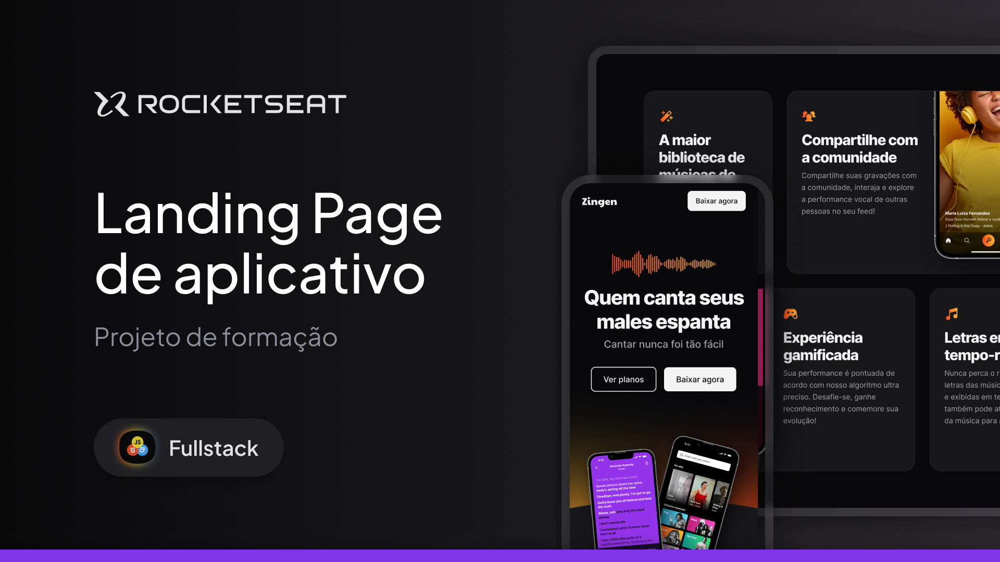

# Zingen - Karaokê 🎤

## 🖼️ Prévia do Projeto



---

## 💼 Sobre o Projeto

O **Zingen - Karaokê** é um projeto desenvolvido como parte do curso Fullstack da Rocketseat, com o objetivo principal de **treinar e demonstrar habilidades em responsividade web utilizando apenas HTML e CSS**. Este site é uma landing page para um aplicativo de karaokê fictício, destacando suas supostas funcionalidades e planos de assinatura, com um design que se adapta perfeitamente a diferentes tamanhos de tela.

## 🎯 Objetivo do Projeto

O foco principal deste projeto é a prática de:

- **Layout Responsivo**: Criar uma interface que se ajusta e funciona bem em diversos dispositivos, desde smartphones a desktops.
- **HTML Semântico**: Utilizar as tags HTML de forma apropriada para estruturar o conteúdo.
- **Estilização Avançada com CSS**: Aplicar técnicas de CSS para criar um design visualmente atraente e funcional, incluindo flexbox, grid e media queries.

**Importante**: Este projeto é uma **landing page estática**. Ele não possui funcionalidades de backend, integração com banco de dados, sistemas de pagamento, ou qualquer lógica de aplicativo real. As "funcionalidades" e "planos" descritos são elementos de conteúdo para simular uma página de produto e servir como base para o treinamento de responsividade.

---

## 💻 Tecnologias Utilizadas

Este projeto foi construído utilizando as seguintes tecnologias web, com ênfase na camada de apresentação:

- **HTML5**: Para a estruturação semântica de todo o conteúdo da página.
- **CSS3**: Para a estilização completa, incluindo a implementação do layout responsivo que garante a adaptação em dispositivos móveis e desktops.

---

## ✨ Conteúdo Apresentado (na Landing Page)

A landing page do Zingen apresenta as seguintes seções de conteúdo, projetadas para demonstrar a responsividade:

- **Header**: Navegação principal com links para seções da página e um botão de download.
- **Hero Section**: Apresentação principal do aplicativo com título impactante e botões de chamada para ação.
- **Seção "Conheça o app"**: Descrição do aplicativo fictício, destacando seu propósito e diferenciais.
- **Seção "Funcionalidades"**: Cards que descrevem as características do aplicativo (biblioteca de músicas, gamificação, gravação, compartilhamento, letras em tempo-real).
- **Seção "Planos e Preços"**: Apresentação dos diferentes planos de assinatura (Básico, Premium, Família) com seus respectivos detalhes.
- **Seção "Download"**: Área para direcionar o usuário para o download do aplicativo nas lojas (App Store e Play Store).
- **Footer**: Rodapé com informações da empresa, links de navegação e ícones de redes sociais.

---

## 🚀 Como Rodar o Projeto

Para visualizar este projeto em sua máquina local, siga os passos abaixo:

1.  **Clone o repositório:**

    ```bash
    git clone [https://github.com/seu-usuario/Zingen-Karaoke.git](https://github.com/seu-usuario/Zingen-Karaoke.git)
    ```

    (Substitua `seu-usuario` pelo seu nome de usuário do GitHub e o nome do seu repositório).

2.  **Navegue até a pasta do projeto:**

    ```bash
    cd Zingen-Karaoke
    ```

3.  **Abra o arquivo `index.html` em seu navegador web.**
    - Você pode simplesmente arrastar e soltar o arquivo `index.html` para a janela do seu navegador, ou clicar com o botão direito e selecionar "Abrir com..." e escolher seu navegador preferido.

---

### 👨‍💻 Autor

Desenvolvido por Wigor.  
Projeto fictício com fins educacionais.
